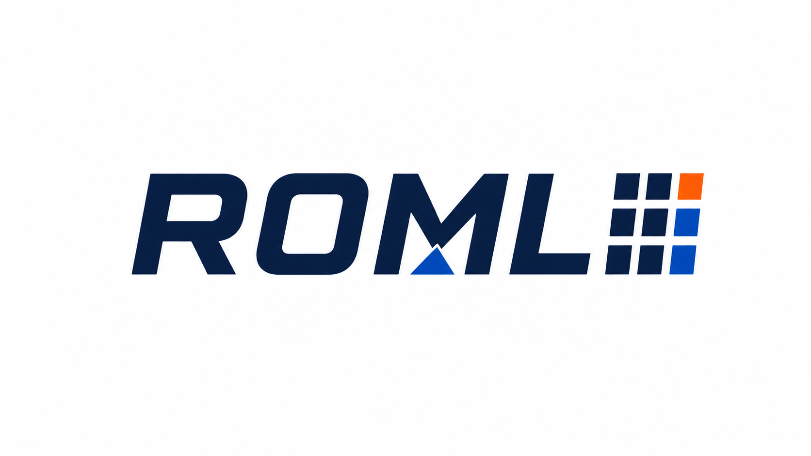

<p align="center">
  
</p>

<h1 align="center">Rust Optimization Modeling Library</h1>

<p align="center">
  Parameter-aware MILP modeling in Rust, designed for incremental updates into long-lived solver sessions.
</p>

<p align="center">
  <a href="https://github.com/sk-surya/roml/actions/workflows/ci-core.yml"></a>
  <a href="https://github.com/sk-surya/roml/actions/workflows/ci-highs.yml"></a>
  <a href="https://github.com/sk-surya/roml/actions/workflows/ci-policy.yml"></a>
  <a href="https://github.com/sk-surya/roml/actions/workflows/ci-coverage.yml"></a>
  
</p>

<p align="center">
  
  
  
  
</p>

ROML tracks parameter dependencies through model coefficients and projects committed
changes as atomic delta batches into solver backends. The core crate is solver-free;
solver adapters integrate the model with engines such as HiGHS.

> **Status:** pre-1.0. The core crate and HiGHS backend are continuously tested on
> Linux, macOS, and Windows, including MSRV, lint, documentation, packaging,
> dependency-policy, security-audit, and coverage checks. The API may still evolve,
> and the crates are not yet published to crates.io.

For the complete modeling guide, see [MODELING_API.md](MODELING_API.md).

## Why ROML?

- **Parameter-aware models:** change a parameter once and propagate its dependent
  coefficients consistently.
- **Incremental solver sessions:** apply structured model deltas without rebuilding
  the entire solver state for every solve.
- **Layered modeling API:** use explicit low-level calls, fluent builders, or macros.
- **Solver-independent core:** model construction and change tracking do not require
  a native solver installation.

## Usage

ROML exposes three complementary modeling layers:

- Explicit low-level APIs: `add_constraint`, `add_coeff`, `add_objective_coefficient`
- Fluent builder APIs: `.le(...)`, `.between(...)`, `.maximize()`, `Model::constrain(...)`
- Optional macros: `constraint!(x + y <= 4.0)`, `constrain!(model, x + y <= 4.0)`

Typical usage with the HiGHS adapter:

```rust
use roml::prelude::*;
use roml::{constrain, set_objective};
use roml_highs::HighsAdapter;

fn main() -> Result<(), Box<dyn std::error::Error>> {
    let mut model = Model::new();

    let x = model.add_var();
    let y = model.add_var();
    let price = model.add_parameter(1.0);

    constrain!(model, x + y <= 4.0)?;
    constrain!(model, x <= 3.0)?;
    constrain!(model, between: 0.0, y, 3.0)?;

    let _obj = set_objective!(model, maximize: price * x + y + 2.0)?;

    model.set_parameter(price, 3.0);
    model.commit();

    let mut adapter = HighsAdapter::new();
    let solution = adapter.solve_model(&mut model)?;

    assert!(solution.is_optimal());
    Ok(())
}
```

If you prefer the method-based API without macros:

```rust
use roml::prelude::*;

let mut model = Model::new();
let x = model.add_var();
let y = model.add_var();

model.constrain((x + y).le(4.0))?;
let obj = model.maximize(x + 2.0 * y + 5.0)?;
assert_eq!(model.objective_constant(obj), Some(5.0));
# Ok::<(), roml::ModelError>(())
```

## Parameters and Transactions

Parameter updates are intentionally queued:

- `set_parameter` records pending changes in the current transaction.
- `commit` applies the queued parameter values and propagates them to dependent
  coefficients as one batch.
- `drain_changes` will auto-commit pending parameter updates and emit a warning
  if you forgot to commit explicitly.

## Logging

The core crate emits log events via the `log` facade. Applications choose their
own logger implementation (e.g., `env_logger`, `log4rs`). ROML no longer
initializes a global logger, writes files, or reads configuration — see
[CONTRIBUTING.md](CONTRIBUTING.md) for development logging setup.

## Backend Setup

### HiGHS

The `roml-highs` crate supports two build modes:

1. **Link an existing install** — set `HIGHS_ROOT` or `HIGHS_LIB_DIR`.
2. **Build from source** — set `HIGHS_SOURCE_DIR=/path/to/HiGHS`.

```bash
# Link an existing install
HIGHS_ROOT=/opt/homebrew/opt/highs cargo test -p roml-highs

# Build from source
HIGHS_SOURCE_DIR=$HOME/src/HiGHS cargo test -p roml-highs
```

Optional environment variables: `HIGHS_EXTRA_LIB_DIRS`, `HIGHS_EXTRA_LIBS`,
`HIGHS_BUILD_SHARED`.

### MOSEK and Xpress

MOSEK and Xpress adapters require separately licensed solver installations and
are not yet qualified for publication. They remain `publish = false` and
experimental during the current release program.

## Building

```bash
# Core (no solver required)
cargo build -p roml
cargo test -p roml --all-targets

# With HiGHS (requires native library)
cargo build -p roml-highs
cargo test -p roml-highs
```

## License

ROML is dual-licensed under `MIT OR Apache-2.0`, at your option.

## Contributing

See [CONTRIBUTING.md](CONTRIBUTING.md) for development setup and workflow.
Security issues: see [SECURITY.md](SECURITY.md).
