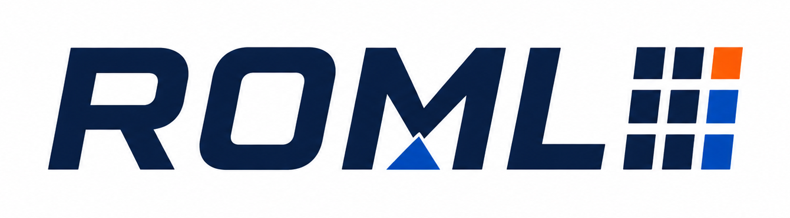

<p align="center">
  
</p>

<h1 align="center">Rust Optimization Modeling Library</h1>

<p align="center">
  Parameter-aware MILP modeling for Rust, designed for incremental updates into long-lived solver sessions.
</p>

<p align="center">
  <a href="https://github.com/sk-surya/roml/actions/workflows/ci-core.yml"></a>
  <a href="https://github.com/sk-surya/roml/actions/workflows/ci-highs.yml"></a>
  <a href="https://github.com/sk-surya/roml/actions/workflows/ci-policy.yml"></a>
  
  
</p>

ROML is a Rust optimization modeling library for building linear and mixed-integer
programs whose coefficients can depend on mutable parameters. When a parameter
changes, ROML projects the update into an already-solved solver session as an
incremental delta — so re-solving after a change is fast and never requires you
to rebuild the model from scratch.

The core crate is solver-free. A backend crate connects the model to a solver
such as [HiGHS](https://highs.dev).

## Installation

The `roml` and `roml-highs` crates are not yet published to crates.io. Add them
from the repository while the pre-1.0 release train is under way:

```toml
[dependencies]
roml = { git = "https://github.com/sk-surya/roml" }
roml-highs = { git = "https://github.com/sk-surya/roml" }
```

The `roml-highs` crate builds HiGHS from source by default (the `bundled`
feature), so no separate HiGHS installation is needed. To link a system HiGHS
instead, use `roml-highs = { git = "...", default-features = false,
features = ["system"] }`.

## Quick start — build and solve an LP with HiGHS

The complete example below builds a small production model, solves it with
HiGHS, and inspects the solution. It compiles and runs as
[`roml-highs/examples/simple_lp.rs`](roml-highs/examples/simple_lp.rs), and is
verified by `roml-highs/tests/readme_quickstart.rs`:

```rust
use roml::prelude::*;
use roml_highs::Highs;

fn main() -> Result<(), Box<dyn std::error::Error>> {
    let mut model = Model::named("production");

    let x = model.add_variable(continuous().named("x"))?;
    let y = model.add_variable(continuous().named("y"))?;

    model.add_constraint((x + y).le(4.0).named("capacity"))?;
    model.add_constraint(x.le(3.0))?;

    model.maximize(3.0 * x + y)?;

    let mut highs = Highs::new()?;
    let solution = highs.solve(&mut model)?;

    assert!(solution.status().is_optimal());
    println!("x = {:?}, y = {:?}, objective = {:?}",
             solution.value(x), solution.value(y), solution.objective_value());
    Ok(())
}
```

There is nothing else to call: `solve` commits your model changes,
synchronizes the solver, runs the solve, and returns a `Solution` — no
revisions, snapshots, deltas, or synchronization calls.

## Incremental parameter updates

Model coefficients can depend on parameters. Change a parameter and call
`solve` again on the same `Highs` instance; the update is applied
incrementally. This example, also compiled and tested
([`roml-highs/tests/readme_incremental.rs`](roml-highs/tests/readme_incremental.rs)),
re-solves with a changed price:

```rust
use roml::prelude::*;
use roml_highs::Highs;

fn main() -> Result<(), Box<dyn std::error::Error>> {
    let mut model = Model::named("pricing");

    let x = model.add_variable(continuous().named("x"))?;
    let y = model.add_variable(continuous().named("y"))?;
    let price = model.add_parameter(parameter(1.0).named("price"))?;

    model.add_constraint((x + y).le(4.0).named("capacity"))?;
    model.maximize(price * x + y)?;

    let mut highs = Highs::new()?;

    let first = highs.solve(&mut model)?;
    assert!(first.status().is_optimal());
    println!("price = 1.0 -> objective = {:?}", first.objective_value());

    model.set_parameter(price, 3.0)?;

    let second = highs.solve(&mut model)?;
    assert!(second.status().is_optimal());
    println!("price = 3.0 -> objective = {:?}", second.objective_value());
    Ok(())
}
```

## How synchronization works

When you call `solve`, ROML performs an implicit commit of pending model
mutations and then synchronizes the solver session:

- **Delta path.** Where the session supports it, ROML projects the model
  revision as an incremental delta batch — parameter changes, bound edits, and
  coefficient updates apply without rebuilding the solver's internal state.
- **Rebuild path.** If a change cannot be expressed as a delta, ROML rebuilds
  the backend from a deterministic model snapshot. At most one automatic
  rebuild retry happens per solve attempt, so synchronization cannot loop.
- **Failure safety.** A failed synchronization or solve never loses model
  operations, and a stale solution is never reported as current. Mathematical
  outcomes (optimal, infeasible, unbounded, …) return `Ok(Solution)`; an
  inability to perform or interpret the solve returns `Err(SolveError)`.

## Crate topology

| Crate | Purpose |
| --- | --- |
| [`roml`](src/lib.rs) | Solver-independent model, expressions, parameters, solutions, and the generic solve orchestration. No native dependencies. |
| `roml-highs` | HiGHS backend. Default `bundled` feature builds HiGHS from source; `system` links an installed HiGHS. |
| `roml-mosek`, `roml-xpress` | Commercial-solver backends. Experimental, unpublished, and not yet qualified. |

The core crate builds and tests without any C/C++ compiler or solver library.
The HiGHS backend is the reference open-source backend for M2.

## Advanced API

Ordinary models need only `roml::prelude::*` and `roml_highs::Highs`. When you
need more control — sparse cell editing, explicit synchronization, backend
extension, or the raw entity IDs — those tools live behind the labeled
`roml::advanced` namespace. The full modeling guide is in
[`MODELING_API.md`](MODELING_API.md).

## Status

ROML is **pre-1.0**. The API may change between releases and the crates are not
yet published to crates.io. The core crate and the HiGHS backend are
continuously tested on Linux, macOS, and Windows — including MSRV (Rust 1.85),
lint, documentation, packaging, and policy checks. Breaking changes are
documented in [`CHANGELOG.md`](CHANGELOG.md) and
[`MIGRATION.md`](MIGRATION.md).

Known limitation: one `Highs` instance is bound to one `Model` — revisions are
model-local, so cross-model reuse (solving a second model with the same
`Highs`) is not supported; create a fresh `Highs` per model.

## License

`MIT OR Apache-2.0`, at your option. See [SECURITY.md](SECURITY.md) for
security reporting and [CONTRIBUTING.md](CONTRIBUTING.md) for development setup.
